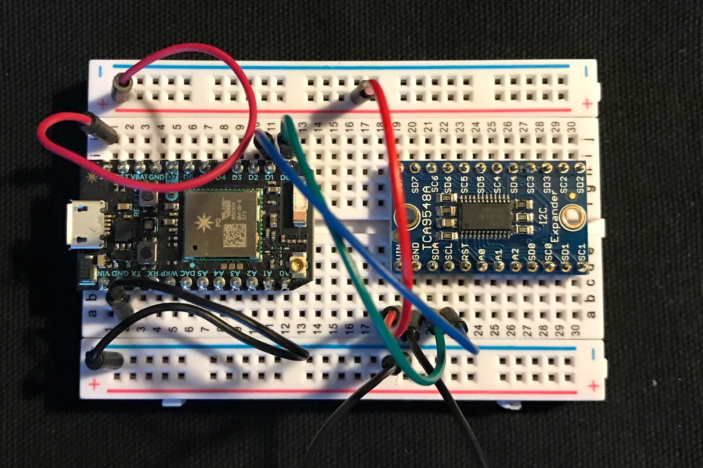

# TCA9548A-RK

*Particle driver for TCA9548A I2C multiplexer*

This handy chip allows 8 separate I2C busses to be connected to a single I2C port. This is handy it you want to connect devices that have conflict I2C addresses. Or if you want to support multiple busses at different voltage levels. 

I purchased mine from [Adafruit](https://www.adafruit.com/products/2717) which has the surface mount chip soldered on a handy breakout board.

## Pinouts

Bottom side:

- 1 - A0
- 2 - A1
- 3 - /RESET
- 4 SD0
- 5 SC0
- 6 SD1
- 7 SC1
- 8 SD2
- 9 SC2
- 10 SD3
- 11 SC3
- 12 GND

Top side:

- 13 SD4
- 14 SC4
- 15 SD5
- 16 SC5
- 17 SD6
- 18 SC6
- 19 SD7
- 20 SC7
- 21 A2
- 22 SCL
- 23 SDA
- 24 VCC

Note that the Adafruit breakout board has built-in pull-up resistors on the SDL and SCL (to Photon/Electron) lines. These can be disabled by cutting two traces on the bottom side of the board.

Also the A0, A1, and A2 lines have internal pull-downs, so the default address is 0 with no connections. There are solder pads on the bottom to change the address permanently.

Finally, the /RESET line has a pull-up on it, so you don't have to connect it unless you want to be able to hardware reset the chip.

If you are using a bare TCA9548A chip you'll need to add your own ties to GND or VCC, and add pull-ups for I2C.

Also note that neither includes pull-ups on the expanded SDAn and SCLn ports! This is intentional so you can pull-up to either 3.3V or 5V depending on what voltage you want to run the bus at. Each port can be run at a different voltage as desired.

## Test Circuit



## Examples

There's not much to this:

```
#include "TCA9548A-RK.h"

TCA9548A mux(Wire, 0);

void setup() {
	Serial.begin(9600);
	mux.begin();
	mux.setChannel(0);
}

void loop() {
}
```

In the constructor, pass the I2C object you are using, normally Wire (D0/D1). On the Electron you can use Wire1 (C4/C5) as well.

The second parameter is the address 0-7, based on what you've set the A0-A3 pins to. The default is 0.

From setup() typically you call mux.begin() to initialize the bus.

Then whenever you want to switch to a different bus, call mux.setChannnel.

Note that the I2C address of the TCA9548A must be different than the address of any I2C device on any bus connected on any of the channels 0-7 as well! 